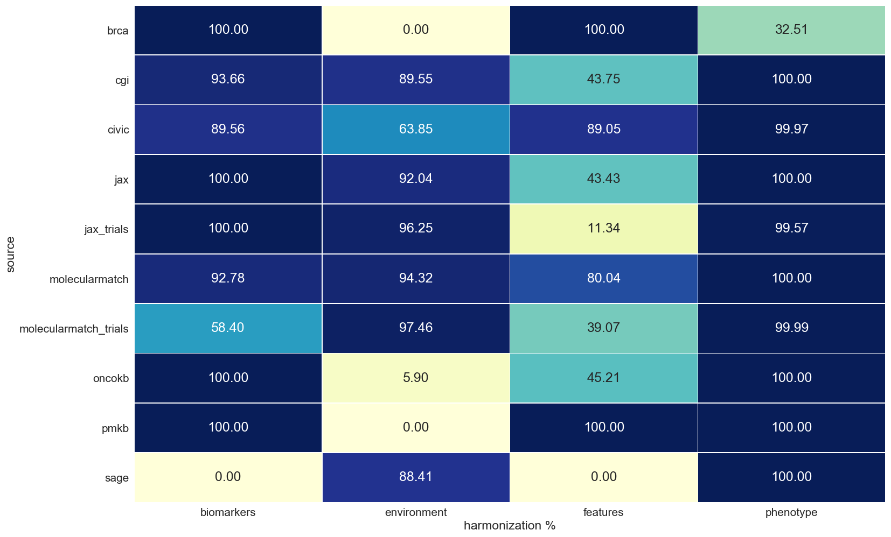
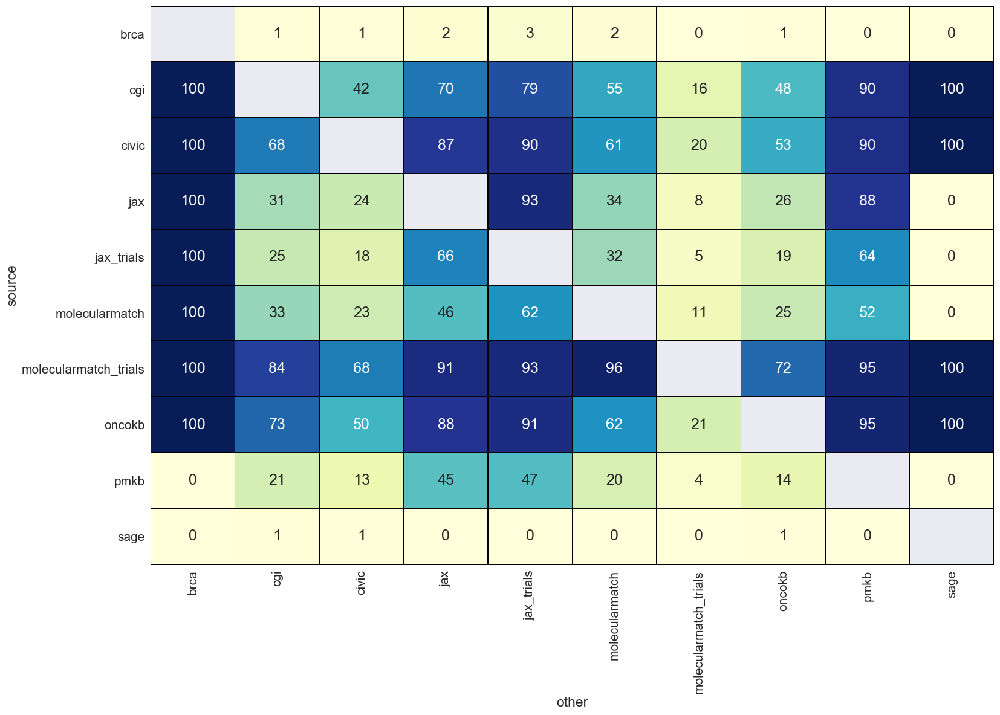
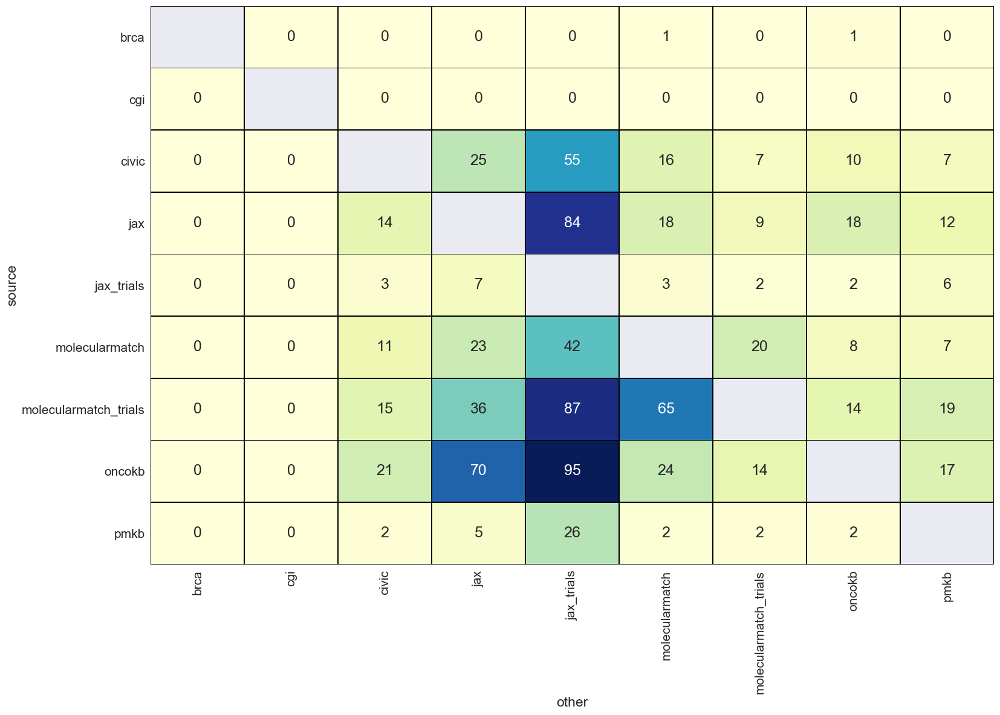
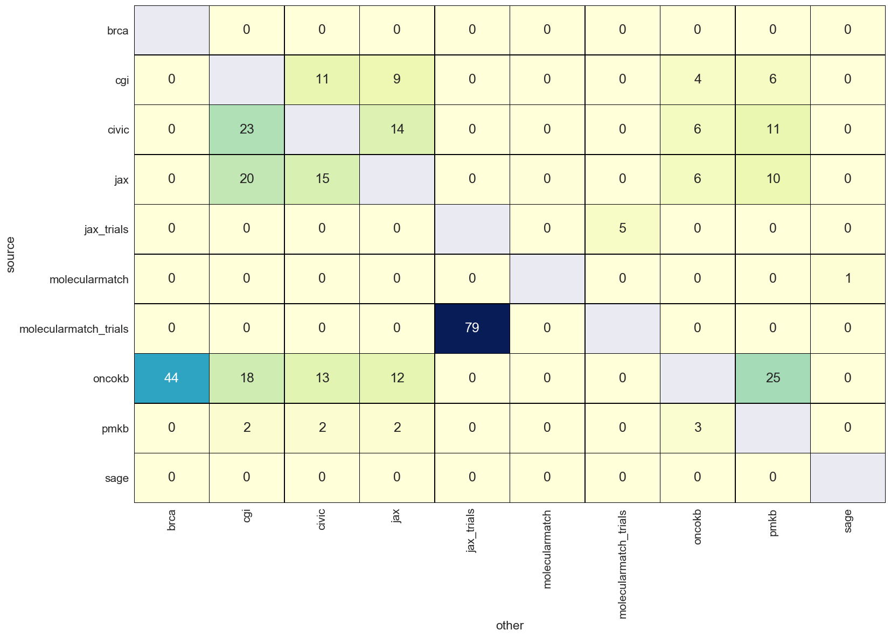
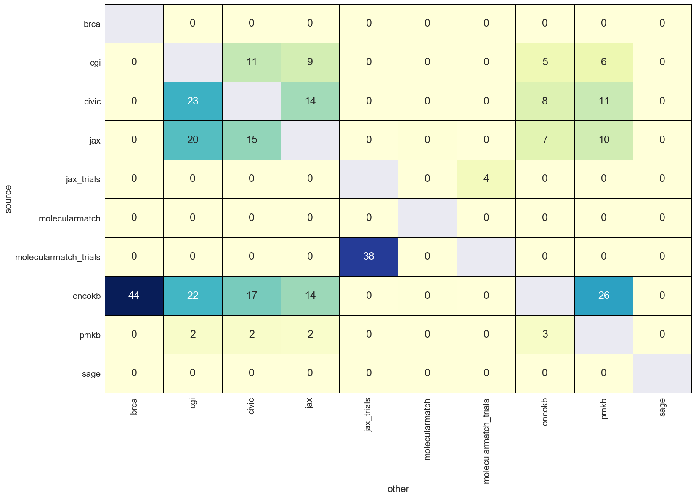
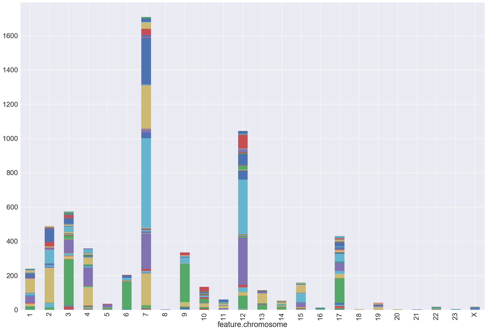
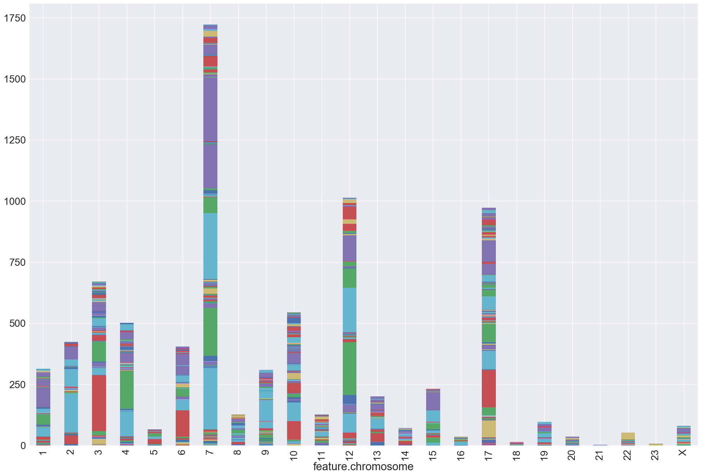
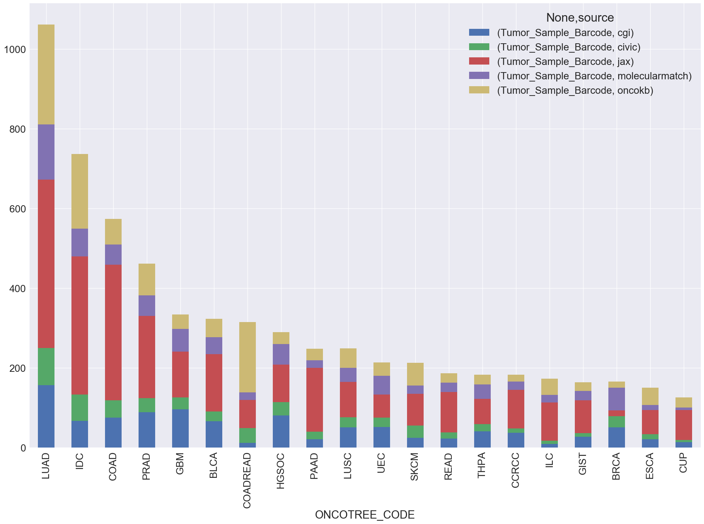
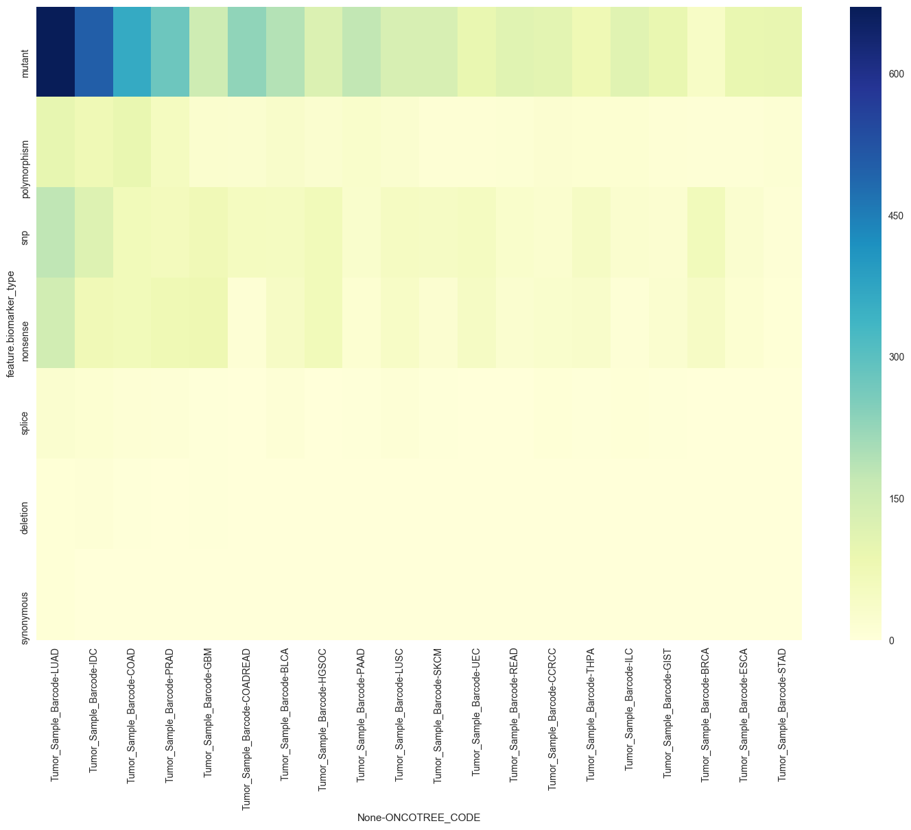

# Figure Candidates

## Harmonizations

### harmonization percentages


*Percentage of association entites that were sucessfully harmonized.*

```
harmonizations = Harmonizations(es_host=args.host, index=args.index)
harmonizations.harmonization_percentages_figure(path='./images/harmonization_percentages.png')
```

## Overlaps


### gene overlaps


*Percentage of others association genes appear in source.*

```
overlaps = Overlaps(es_host=args.host, index=args.index)
overlaps.gene_overlaps_figure(path='./images/gene_overlaps.png')
```


### feature overlaps


*Percentage of others association features appear in source.*

```
overlaps = Overlaps(es_host=args.host, index=args.index)
overlaps.feature_overlaps_figure(path='./images/feature_overlaps.png')
```

### publication overlaps


*Percentage of others association evidence publications appear in source.*

```
overlaps = Overlaps(es_host=args.host, index=args.index)
overlaps.publication_overlaps_figure(path='./images/publication_overlaps.png')
```


### phenotype overlaps


*Percentage of others association phenotype appear in source.*

```
overlaps = Overlaps(es_host=args.host, index=args.index)
overlaps.phenotype_overlaps_figure(path='./images/phenotype_overlaps.png')
```

### environment overlaps


*Percentage of others association environment appear in source.*

```
overlaps = Overlaps(es_host=args.host, index=args.index)
overlaps.environment_overlaps_figure(path='./images/environment_overlaps.png')
```

## Cohorts


### phenotypes by source


*Breakdown of top twenty phenotypes in g2p knowledgebases.*

```
cohorts = Cohorts(es_host=args.host, index=args.index)
cohorts.g2p_phenotypes_by_source_figure(path='./images/g2p_phenotypes_by_source.png')
```

### g2p phenotypes by chromosome


*Show the evidence phenotypes mapped to feature chromosome.*

```
cohorts = Cohorts(es_host=args.host, index=args.index)
cohorts.g2p_phenotypes_by_chromosome_figure(path='./images/g2p_phenotypes_by_chromosome.png')
```


### genie samples by chromosome


*Show the evidence phenotypes mapped to tumor sample to feature chromosome.*

```
cohorts = Cohorts(es_host=args.host, index=args.index)
cohorts.genie_samples_by_chromosome_figure(path='./images/genie_samples_by_chromosome.png')
```


### genie samples by oncotree


*Breakdown of top twenty genie clinical phenotypes in g2p knowledgebases.*

```
cohorts = Cohorts(es_host=args.host, index=args.index)
cohorts.genie_samples_by_oncotree_figure(path='./images/genie_samples_by_oncotree.png')
```

### genie biomarkers


*Breakdown of top twenty genie clinical phenotypes by bio marker type.*

```
cohorts = Cohorts(es_host=args.host, index=args.index)
cohorts.genie_biomarkers_figure(path='./images/genie_biomarkers.png')
```


# Raw counts

[raw counts](html/raw_counts.html)
